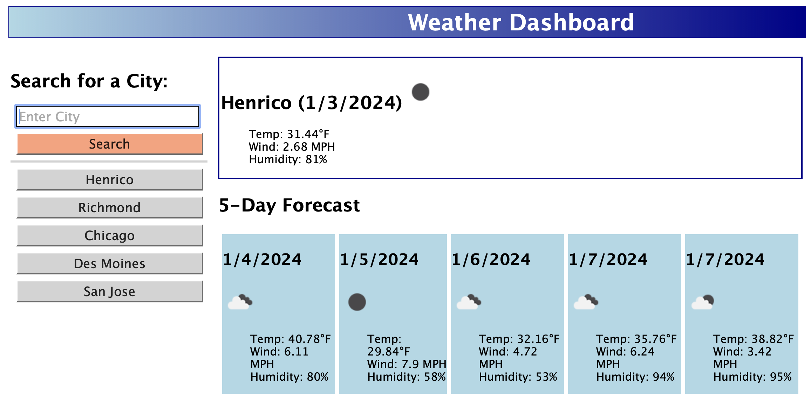

# Weather-Dashboard
Bootcamp challenge 6: Server-Side APIs

This is a weather app that allows the user to display weather forecasts using the [OpenWeather](https://openweathermap.org) API. Cities from previous searches are saved and may be updated by clicking the button. Users can retrieve forecasts by clicking the search button or pressing Enter after typing the city.

The page is deployed at: 

 

